# Tarea 1
Repositorio para la Tarea 1 del curso Redes Neuronales y Programación Genética

Lenguaje utilizado: Python 3.7

# Implementación

En este directorio se encuentra la implementacion para una red neuronal.

### Neuronas
La implementacion de neuronas se realiza con la clase [``Perceptron``](./Perceptrons/Perceptron.py).

Posee las variables _bias_, _weights_, _output_, _delta_, _lr_ (learning rate) y _activation_ (funcion de activacion).

En el caso de querer iniciar un objeto de la clase ``Perceptron`` sin pesos especificos, se debe indicar el numero de inputs esperados.

Si bien esta implementacion posee los metodos _train_ y _train\_all_, estos solo se utilizan cuando se quiere que una neurona aprenda individualmente y no como parte de una capa ni de una red neuronal (mas detalles en los siguientes parrafos).

### Red Neuronal
Para implementar la red neuronal se utilizan dos clases las clases [``NeuronLayer``](./Perceptrons/NeuronLayer.py) y [``NeuralNetwork``](./Perceptrons/NeuralNetwork.py), que representan una capa de perceptrones y una red neuronal respectivamente.

La clase [``NeuronLayer``](./Perceptrons/NeuronLayer.py) posee las variables _n_ (numero de neuronas en la capa), _is\_output_, _next\_layer_ (siguiente capa en la red), _prev\_layer_ (capa anterior en la red) y _neurons_ (una lista de _n_ neuronas).

La clase [``NeuralNetwork``](./Perceptrons/NeuralNetwork.py) posee las variables _f_ (dimension de los inputs), _n_layers_ (numero de capas escondidas mas uno), _layers_ (una lista de capas de neuronas).

### Funciones de activacion

Se implementan tres funciones de activacion en sus propias clases, estas son [``Step``, ``Sigmoid`` y ``Tanh``](./Perceptrons/Activation.py). En estas se tienen metodos para aplicar la funcion, calcular la derivada de la funcion para un input y calcular la derivada funcion para un output de la misma. Estos metodos son _apply_, _derivative_ y _derivate_output_ respectivamente.


### Normalizacion, 1-hot encoding y particion

La normalizacion y la clasificacion en 1-hot encoding se realiza con funciones implementadas en el archivo [utils.py](./Perceptrons/utils.py).

Para llevar a cabo la particion del dataset en sets de entrenamiento y prueba, se decidio utilizar la libreria [scikit-learn](https://scikit-learn.org/stable/).

### Apreciaciones

Entre las dificultades de esta implementacion se encuentra el reconocimiento de los valores y/o variables relevantes que modificar y retornar (o no) en metodos como _feed_ y _train_. Tambien hubo dificultades cuando se intento optimizar la cantidad de variables de instancia de las distintas clases utilizadas.

En cuanto a la eficiencia de la red utilizada, se cree que trabaja en tiempos mas lentos que una red implementada utilizando multiplicacion de matrices, esto debido a que, entre otros, computa ejemplo por ejemplo, sin optimizar tiempos por batch de datos.

# Análisis

El analisis se realiza con datos del [_seeds dataset_](https://archive.ics.uci.edu/ml/datasets/seeds). Los datos se separan en atributos y clasificacion; para los atributos se normalizan los datos y para la clasificacion se codifican los valores. Posterior a esto se particionan los datos. La implementacion de esto se encuentra en el archivo [seeds_training.py](./Perceptrons/seeds_training.py).


Se realizan tres 'tipos' de 'experimentos'. El primero es variar las funciones de activacion y cantidad de neuronas por capa con dos capas escondidas. El segundo es variar la tasa de aprendizaje para redes con dos capas escondidas y con _tanh_ como funcion de activacion. El tercero es variar la cantidad de neuronas por capa para redes con cuatro capas escondidas.

A continuacion se muestran algunos resultados, viendo curvas de aprendizaje, error de la red en las distintas epocas de entrenamiento y la matriz de confusion luego de todas las epocas.

Todos los graficos generados y descripcion de dimensiones utilizadas se encuentran en el directorio [analisis_plot](./Perceptrons/analisis_plots).

## Sigmoid y dos capas escondidas
Estos son los resultados obtenidos al entrenar una red con todas sus neuronas con sigmoid como funcion de activacion, 0.6 de tasa de aprendizaje y 2 capas escondidas.
### Curvas de aprendizaje
La curva de aprendizaje obtenida es similar a la esperada, con un aumento practicamente sostenido, y luego de cierta cantidad de epocas se "estanca" en un porcentaje de aciertos razonables.

En casi todos los experimentos es asi menos al tener pocas (1 o 2) neuronas por capa, en la cual nunca se supera el 80% de aciertos.

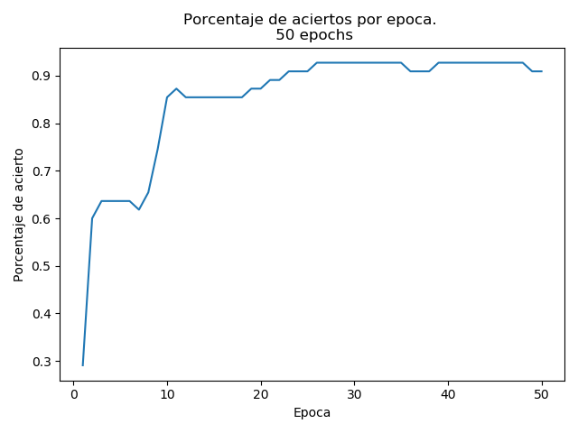

### Error de la red
El error obtenido muestra una curva que disminuye sus valores de forma suave, lo cual es lo esperado. El valor del error en la ultima epoca computada es muy cercano a 0, por lo que se espera que la red halla logrado un aprendizaje correcto.

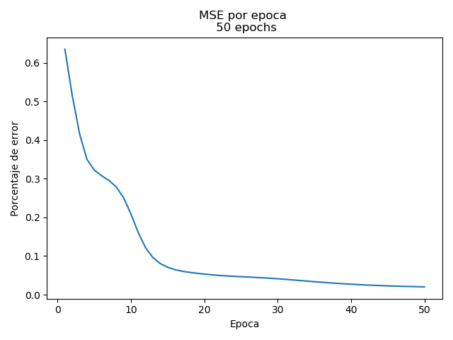
### Matriz de confusión
La red logra clasificar la mayoria de los ejemplos de prueba correctamente, fallando solo en 5. Otras redes probadas en esta seccion tienen una cantidad de fallos similares, menos las red con pocas neuronas por capa, que falla en 13 ejemplos.


## Sigmoid y cuatro capas escondidas
Para estos experimentos se queria observar como se comportaba una red al aumentar el numero de capas escondidas.

Si bien en general se ven mas variaciones en los aciertos y errores entre epocas que en el caso de tener dos capas escondidas, la matriz de confusion final aqui mostrada no es tan diferente a lo esperado (diagonal diferenciable). El comportamiento es el esperado (aumento de aciertos, disminucion de error), la diferencia es que entre epocas se tiene una curva no suave.

Los graficos aqui mostrados son resultados de la primera red neuronal con cuatro capas escondidas. Se debe notar que para la segunda red (con pocas neuronas por capas), se tiene un resultado con mucho error y una curva de aprendizaje como linea horizontal (no aprende nada). En este mismo experimento, al aumentar la cantidad de neuronas por capas se obtienen curvas mas parecidas a las obtenidas al utilizar dos capas escondidas.

### Curvas de aprendizaje
Se observa que la red mejora su acierto, pues a partir de la epoca 25 esta siempre sobre 0.6 de acierto, sim embargo presenta variaciones en un rango de 0.25. Estas variaciones pueden deberse a que se tienen mas capas escondidas que las optimas para trabajar con el dataset utilizado.

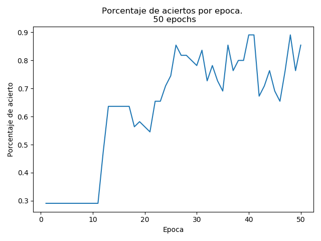

### Error de la red
El error de la red va disminuyendo, pero es solo despues de la epoca 30 que pareciera quedarse en los valores más bajos que puede alcanzar. Esto se condice con lo observado en el grafico de aciertos.

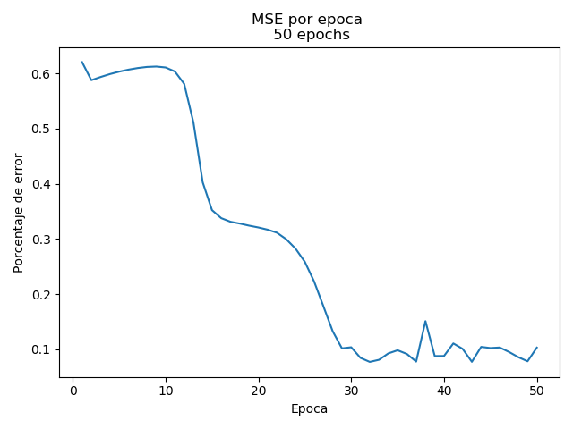
### Matriz de confusión
Se observa que la matriz de confusión de la red presenta una buena cantidad de aciertos, pero sigue fallando en algunos casos (lo que es razonable).

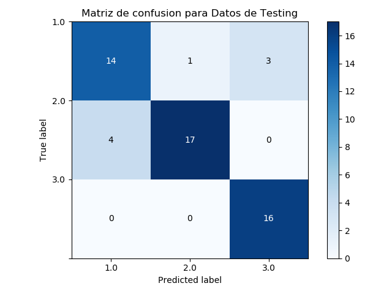


## Tanh y diferentes tasas de aprendizaje
Para estos experimentos se utilizan redes neuronales con dos capas escondidas, en donde todas las funciones de activacion corresponden a tanh.

Estos graficos se generaron debido a que la variacion en el error y acierto -para una red similar a la de los primeros resultados presentados- era significativa, por lo que se quiso ver si fue un error de implementacion o si era por la naturaleza de la funcion.

### Curvas de aprendizaje
Los aciertos obtenidos para ambas redes aqui presentadas tienen un aumento esperado. Sin embargo, la red con un _learning rate_ mayor modifica mucho sus valores entre epocas, por lo que el porcentaje de aciertos no pareciera converger. En la red con neuronas con _learning rate_ igual a 0.2, no se tiene una curva tan suave como en la seccion con dos capas y sigmoid, pero tiene menores variaciones que la otra red presentada en esta seccion.


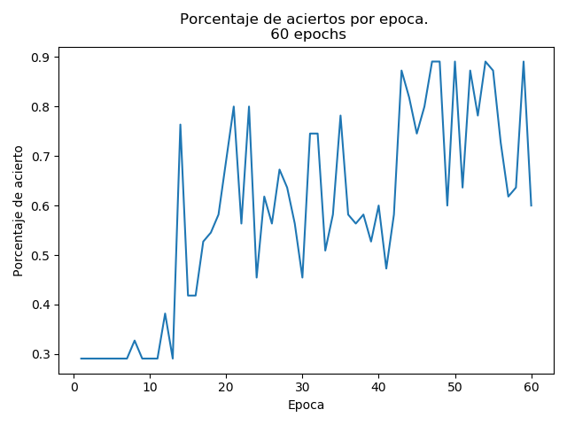
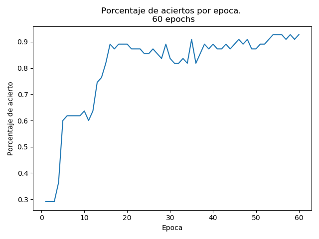


### Error de la red
Para el primer ejemplo, se tiene que el error va disminuyendo, sin embargo tiene unas alzas y variaciones notorias entre epocas. En cuanto al segundo grafico, se tiene que el error disminuye de forma mas suave, y que si bien tiene alzas, estas son de una amplitud menor.

A partir de estos resultados, se observa que tanh trabaja mejor con una tasa de aprendizaje mas pequeña.

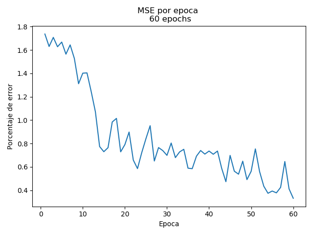
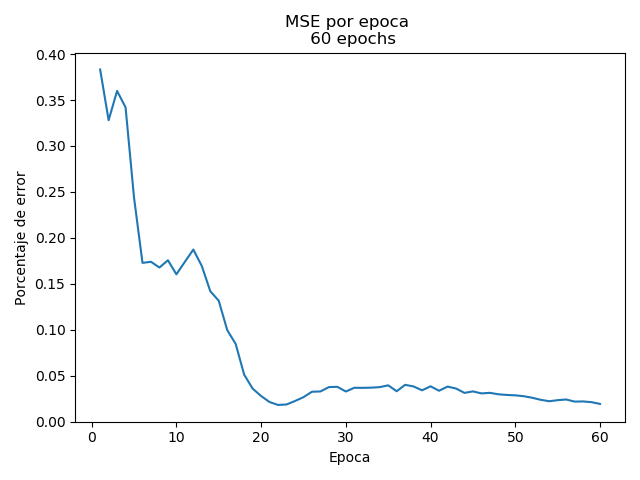

### Matriz de confusion
Si bien todos los experimentos pueden variar, aqui se presentan resultados similares a la mayoria de aquellos obtenidos.

Para la red que tiene una tasa de aprendizaje mayor (0.6), al final de 50 epocas realiza un muy mal trabajo clasificando los ejemplos, sobre todo al predecir la clase **2**. En cambio, para una red con tasa de aprendizaje 0.2, se tiene que puede clasificar en la clase **2**, teniendo un mayor porcentaje de aciertos.

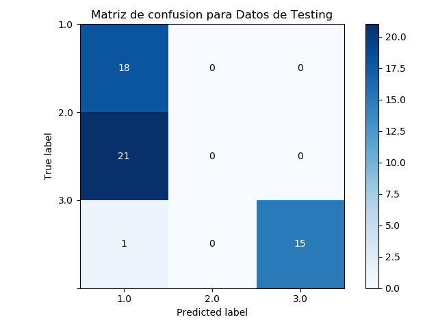
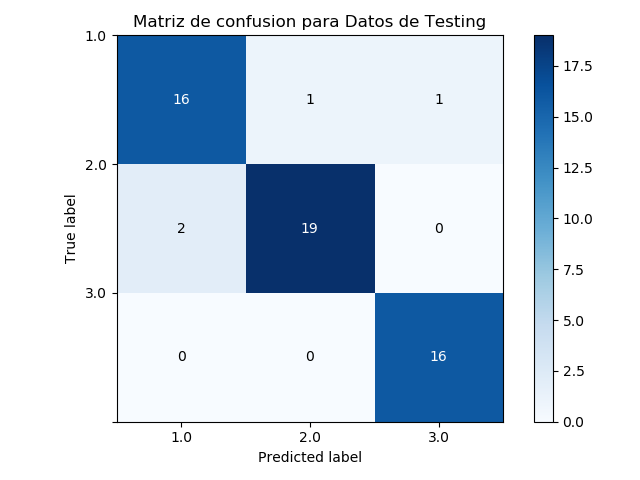


# Instaleichon y usaje
Para correr el codigo se debe activar un entorno virtual de Python. 
Ver documentacion de Python para [creacion de entornos virtuales.](http://docs.python.org.ar/tutorial/3/venv.html#creando-entornos-virtuales)

La instalacion de paquetes necesarios para utilizar este codigo puede realizarse con pip y ejecutando la siguiente linea.
```bash
pip3 install -r requirements.txt
```

Para generar los graficos y output del entrenamiento de una red con los datos del [dataset _seeds_](https://archive.ics.uci.edu/ml/datasets/seeds), se debe correr el programa seeds_training.py con la siguiente linea.
```bash
python3 Perceptrons/seeds_training.py
```