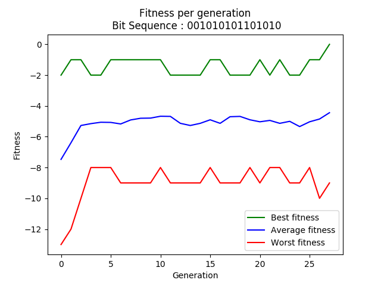
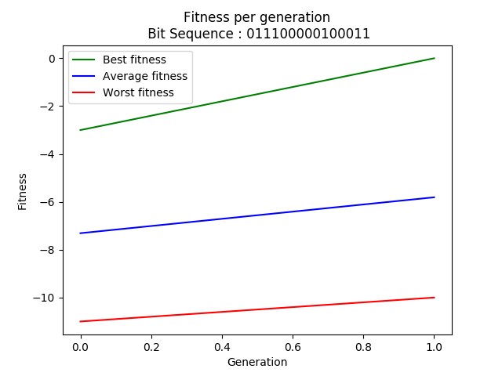
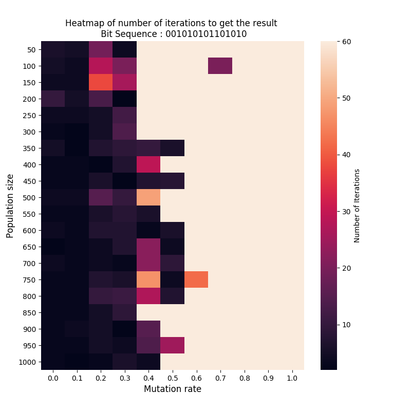
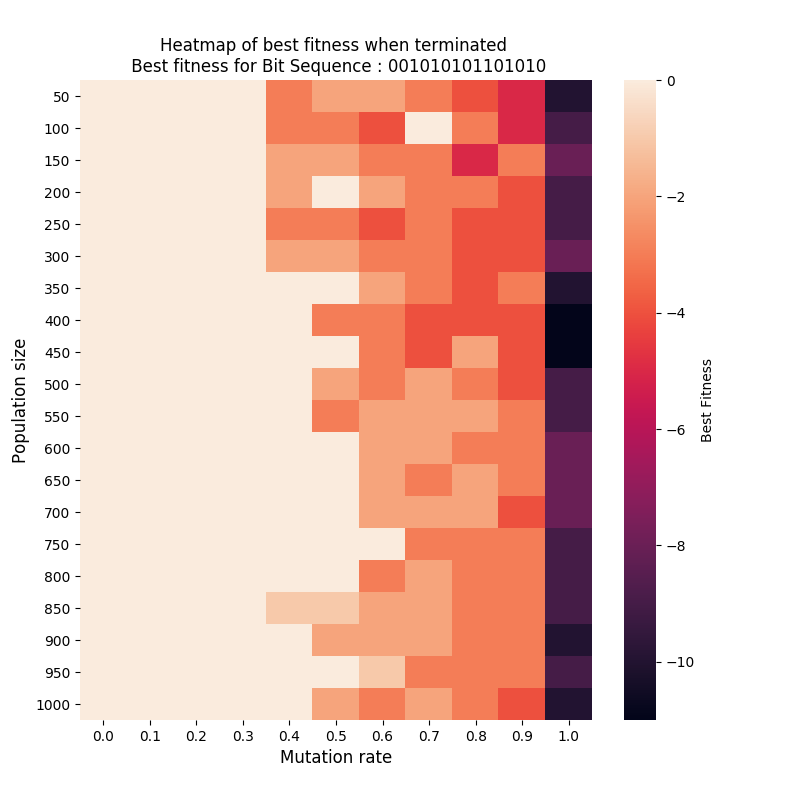

# Tarea 2

Repositorio para la Tarea 2 del curso Redes Neuronales y Programación Genética

Lenguaje utilizado: Python 3.7

## Implementación

En este directorio se encuentra la implementación de un algoritmo genético en la clase [``GeneticAlgorithm``](./GeneticAlgorithm.py), además de aplicaciones del algoritmo para distintos problemas.

Los problemas incluidos son:

1. [Secuencia de bits](./bitSequence.py): dada una secuencia de bits, que el algoritmo encuentre cual es.
2. [Encontrar una palabra](./wordFind.py): dada una palabra, que el algoritmo encuentre cual es.
3. [Transformar número a su representación binaria](./numberToBinary.py): dado un numero en decimal, encontrar su representación binaria.
4. [0-1 Knapsack](./knapsack.py): dada 5 cajas con pesos y valores cada una, encontrar cuales llevar tal que se maximice el valor sin sobrepasar un cierto peso.

## 0-1 Knapsack
El problema elegido es **0-1 - Knapsack**. Se considera una mochila que aguanta 15kg. Las cajas utilizadas en este problema son las siguientes:

1. Caja de peso 12, valor 4.
2. Caja de peso 2, valor 2.
3. Caja de peso 1, valor 2.
4. Caja de peso 1, valor 1.
5. Caja de peso 4, valor 10.

En este problema, solo se puede usar cada caja una vez.

### Modelado del problema
Se considera que un **individuo** es un arreglo de largo **5** (o la cantidad de cajas que sean permitidas en el problema), que representa las cajas a llevar. Los **genes** son binarios, es decir son _1_ o _0_, que indican si la caja que tiene como número la posición en que se encuentra el gen se lleva o no en la mochila.

Un ejemplo de esto es el siguiente individuo:

🎒 = [1, 0, 0, 1, 0]

Este individuo indica que se lleva la caja 1 y la 4, teniendo un peso total de 13 y valor total de 5.

Para computar estos valores se tienen las siguientes variables:

    NUMBER_OF_GENES = 5
    W = 15
    BOX_WEIGHT = [12, 2, 1, 1, 4]
    BOX_VALUE = [4, 2, 2, 1, 10]

La **función de fitness** se calcula como el valor total que se lleva en la mochila representada por el individuo, y en el caso de que sobrepase el peso máximo _W_, se resta una penalización dependiente del exceso de peso, escalado por la suma de pesos de las cajas. Para más detalles, ver _fitness\_function_ en [knapsack.py](./knapsack.py). 

La condición de término es que el 95% de la población tenga el máximo valor de fitness encontrado.

El resultado obtenido es:

    best individual >  [0, 1, 1, 1, 1]
    total weight:  8
    total value:  15

Este resultado muestra que se deben llevar las mochilas 2, 3, 4 y 5, lo cual suma un valor total de 15 sin pasar el límite de peso.

No se necesitaron cambios en el algoritmo genético implementado para resolver este problema.

## Análisis

### Comentarios de implementación

El algoritmo implementado puede ser útil para buscar resultados y optimizaciones de resultados para problemas que pueden parecer complejos o no triviales.
La dificultad puede estar en encontrar la forma de modelar el problema, tanto en la elección de individuos como en la creación de
una función de fitness que se adecue al problema.

Entre las aplicaciones del problema resuelto es la elección de tareas para hacer en un fin de semana (que tiene horas limitadas), considerando cuantas horas
se estima que demoraría en realizarla, además de cuánto valor se le entrega a la tarea, teniendo en cuenta la nota necesaria para pasar.

La implementación aquí presentada puede ser mejorada en términos de optimización de código, por ejemplo la selección de padres para un offspring
no es necesario que sea el doble del tamaño de la población, siendo reducible. Para cambiar esto sería necesario modificar el método de selección
y de crossover.
### Comportamiento del algoritmo
Se evalúa el comportamiento del algoritmo para el problema de secuencia de bits.
#### Mejora de _fitness_ por generación
Se presenta el cambio en el fitness por generación para dos secuencias de bits:
011100000100011 y 001010101101010, ambas de largo 15. La función de fitness para este problema considera la cantidad de bits diferentes entre el individuo evaluado y
la secuencia esperada.

Para la primera secuencia se observa que el mejor fitness para todas las generaciones nunca bajó de 2 bits de diferencia.
En cuanto al fitness promedio, se observa una mejora gradual en el mismo, comenzando desde un valor cercano a -8 hasta llegar a uno cercano a -5.
El cambio más drástico lo presenta la evolución del peor fitness por generación, esto porque el valor comienza muy bajo, con individuos casi
completamente distintos a la secuencia esperada, que se corrige en menos de 5 generaciones, llegando a un valor bajo (-8), pero sigue siendo mejor
que un individuo completamente diferente.
Puede considerarse que el peor valor de fitness es siempre muy bajo, lo que puede ser un problema en el proceso de selección, sin embargo el
que existan puede ayudar al problema de que un algoritmo genético puede dominar una porción de individuos con buen fitness pero
no óptimos. Esto provocaría una dificultad para llegar a la solución óptima. Estos valores también son explicados por la tasa de mutación
elegida para el algoritmo que debe encontrar esta secuencia (0.2 -> 3 genes mutados).



Para la segunda secuencia se observa que se llega a la solución en la segunda generación.
Por como evoluciona el promedio y peor fitness, se observa que el mejor fitness puede haber sido logrado porque se aprovecha tanto el crossover como
la mutación de genes, ya que su pendiente es más grande que la de las otras curvas.


#### Heatmap de configuraciones
Se realiza el heatmap de configuraciones para la secuencia 001010101101010. Se observa que los mejores resultados se obtienen cuando se tiene un mutation rate igual o menor a 0.5.
Esto entendiendo como mejor resultado aquel en que el algoritmo llega a la respuesta correcta en menos de 60 iteraciones.
Este resultado es esperable porque no se "deshace" todo el avance de un individuo seleccionado, ya que se cambian menos de la mitad de bits del mismo en cada generación.
Dentro de los buenos resultados, se observa que los mejores se encuentran cuando la tasa de mutación es 0.0 o 0.1.
Los mejores resultados se ven cuando las poblaciones son de tamaños entre 300 y 800 individuos.


Se grafica un heatmap para la mejor fitness de la población luego de las 60 iteraciones.
Los resultados aquí mostrados representan que tan malos fueron los "malos resultados".
En estos se observa que el tener una tasa de mutación de 1.0 es malo, lo cual se explica con el hecho de que cambiar todos los genes de
un individuo que se espera que tenga padres relativamente buenos, es malo para la convergencia del algoritmo.
Se muestra que en el aumento de la tasa de mutación, es más difícil llegar a un resultado óptimo. 
De esta misma forma, con población más pequeña, el mejor fitness es más bajo que cuando se usa una población más grande.


# Instaleichon y usaje
Para correr el código se debe activar un entorno virtual de Python. 
Ver documentación de Python para [creación de entornos virtuales.](http://docs.python.org.ar/tutorial/3/venv.html#creando-entornos-virtuales)

La instalación de paquetes necesarios para utilizar este código puede realizarse con pip y ejecutando la siguiente línea.
```bash
pip3 install -r requirements.txt
```

Tal como se encuentran en este repositorio, los archivos [wordFind.py](./wordFind.py), [numberToBinary.py](./numberToBinary.py) y [knapsack.py](./knapsack.py) solo generan salidas a stdout. En el caso de [bitSequence.py](./bitSequence.py), se generan los gráficos presentados en la sección de Análisis junto con feedback de avance de cómputo en salida estándar.

```bash
python3 nombre_del_archivo.py
```