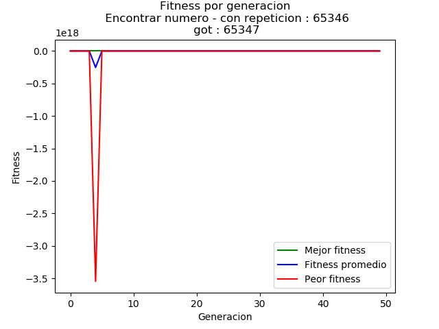
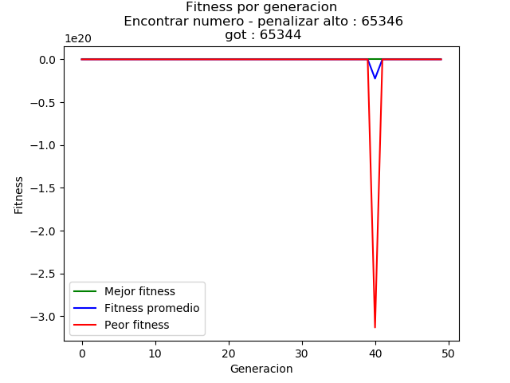
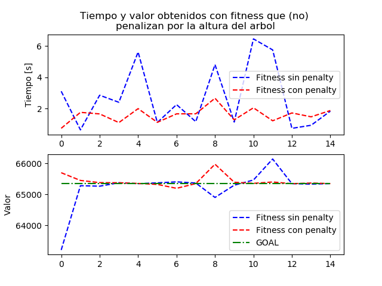
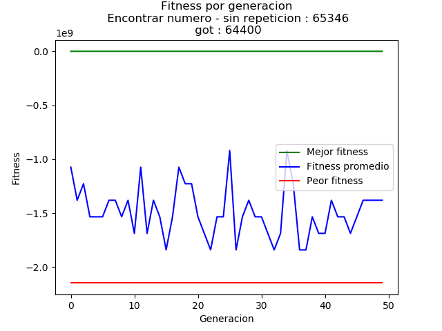
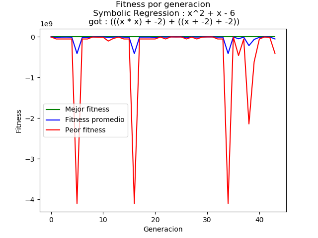
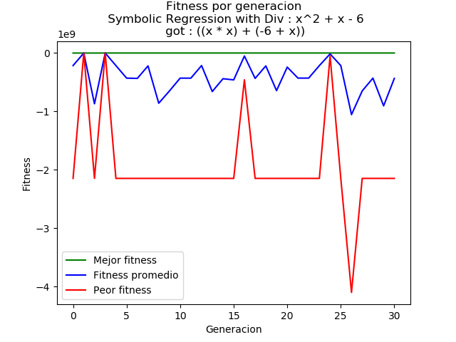
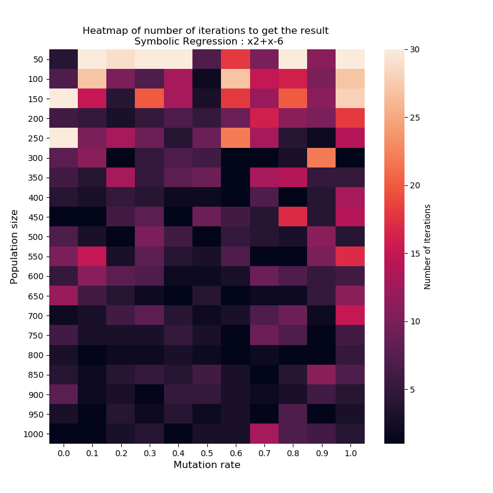

# Tarea 3

Repositorio para la Tarea 3 del curso Redes Neuronales y Programación Genética

Lenguaje utilizado: Python 3.7

## Implementación

En este directorio se encuentra la implementación de un algoritmo genético en la clase [``GeneticAlgorithm``](./GeneticAlgorithm.py),
adaptado para trabajar con _Abstract Syntax Trees_ y generar programas que permitan, entre otros, encontrar ecuaciones que
se acerquen a un conjunto de puntos o a una expresión en particular. 

La librería de arboles utilizada es la entregada, y se encuentra en [arboles.py](./arboles.py) sin los comentarios originales. Además incluye el nodo para la división y modificaciones para utilizar variables.

El generador aleatorio de arboles también es el provisto, y se encuentra en [AST.py](./AST.py) (solo se modificó el nombre del archivo). 


## Ejercicios

### Encontrar Número
Todos los programas ejecutados generan arboles con límites de altura, lo que permitió correrlos sin que se cayeran.
#### Sin límite de repeticiones
Se corre el algoritmo genético con una población de 14 individuos, con arboles con altura máxima 10, un 20% de elitismo 
y 70% como tasa de mutación. Además se corre por un máximo de 50 iteraciones. 



En este caso se obtiene 65347, a una unidad del número buscado. En el gráfico superior se observan las tres curvas de 
fitness para el problema. A continuación se aislan las curvas de fitness promedio y mejor fitness por generación.

_65346.png)

En el siguiente gráfico se observa la mejora de el/los individuos con mejor fitness, la cual presenta un alza acelerada
en las 10 primeras generaciones, y posterior a esto presenta una mejora lenta pero aparentemente estable.

_65346.png)
#### Fitness

Al igual que la sección anterior, se corre el algoritmo genético con una población de 14 individuos, con arboles con altura máxima 10, un 20% de elitismo 
y 70% como tasa de mutación. También se corre por un máximo de 50 iteraciones. 



En este gráfico se observa un comportamiento similar al del problema con fitness sin penalización, pero se tienen valores
menores debido a la misma penalización. En cuanto a la respuesta, el valor obtenido es 65344, lo cual es 2 unidades de diferencia
con el valor buscado.

_65346.png)

En este caso la mejora es aparentemente más rápida en las 5-7 primeras iteraciones y luego presenta una pendiente positiva,
 pero no tan inclinada como la de la primeras generaciones.
 Por la penalización, comienza en valores de -mejor- fitness menores a los obtenidos cuando no se tenía penalización.

_65346.png)

##### Comparación de tiempos: fitness sin y con penalización por alto
Para comparar los tiempos obtenidos con distintas funciones de fitness se corre 15 veces el algoritmo genético por función,
en donde se limitan los arboles a una altura máxima igual a 15, con altura inicial máxima de 6. La comparación se hace usando
un elitismo de 20% y una tasa de mutación igual al 70%, sobre una población de 14 individuos por un máximo de 50 iteraciones.

En el eje y se encuentra tanto el tiempo que tarda el algoritmo en terminar/encontrar la solución, como el valor encontrado.
En el eje x se enumeran los distintos experimentos.



En el caso del algoritmo genético que utiliza la función de fitness que penaliza el alto del árbol, el tiempo en los 
distintos experimentos es generalmente menor, además de estar más cerca del valor buscado en la mayoría de los casos.
Así se prueba que el castigar a los arboles por crecer demasiado es efectivo para evitar que el programa se vuelva más lento.
La implementación realizada para obtener estos resultados se encuentra en [find_number.py](./find_number.py).

#### Sin repetición

Luego de cambiar el generador de arboles al correspondiente para este ejercicio, se corre el algoritmo con una altura máxima de sub-arbol
igual a 6 y una altura máxima inicial de 2. Elitismo, tasa de mutación, población e iteraciones igual a las anteriores.



En este caso el valor encontrado es 64400, el cual corresponde a evaluar la expresión **((100 * 7) * (4 * (25 - 2)))**. 
Debido a que se castiga a aquellos arboles con terminales repetidos, -en este caso- siempre existe un árbol que repite
alguno, por lo que el peor valor de fitness es siempre el mismo, que es igual al mínimo valor definido como **MIN_SYS**
en [find_number.py](./find_number.py).

_65346.png)

La curva de fitness promedio varía bastante porque es muy probable que se generen arboles con terminales repetidos, lo que
explicaría la tendencia hacia valores más negativos y el que se mantenga en un orden tan alto. 

_65346.png)

El mejor fitness varía en pocos (dos) valores, lo cual es explicable debido a que, como se dijo anteriormente, es muy probable que se
generen arboles con terminales repetidos, por lo que muy pocos de ellos son válidos y se conservan los con mejor fitness. 
Más en detalle, si en el crossover y mutación se generan solo árboles con terminales repetidos, debido al elitismo se mantiene en las generaciones aquel árbol que se generó en un comienzo y que, en este caso, es válido.

### Implementar variables
Para implementar variables se modifica la librería de arboles, haciendo que el método
_eval_ de ``Node`` pueda recibir un diccionario, el cual se espera que contenga las variables que puede tener el árbol
y los valores correspondientes. Además, el método _eval_ en ``TerminalNode`` cambia, pasando de retornar solo el valor
del nodo a retornar el mismo valor si este no es de tipo **str**, de otra forma se retorna el valor indicado en el diccionario.
### Symbolic Regression
Para el problema de _Symbolic Regression_ se utiliza el algoritmo genético adaptado para encontrar la ecuación x^2 + x - 6.
Se usan como terminales los enteros de -10 a 10 inclusive, además de la variable _x_ (repetida 21 veces para que tenga la 
misma probalidad de aparecer que un número).

La función de fitness utilizada es la suma de las diferencias de la ecuación obtenida por el algoritmo con la ecuación a encontrar, 
en todos los valores posibles de _x_. Además penaliza a aquellos árboles cuya altura sea mayor a 3.


 
En cuanto al fitness promedio (en una población de  10 individuos) parece no ser muy buena, además va oscilando debido a la 
aparición de individuos con fitness muy malo (de -4E9 según lo apreciable en el gráfico que contiene las 3 curvas). 
 
_x2+x-6.png)  

Al aislar la curva de mejor fitness por generación se observa que efectivamente va mejorando, lo que se ve en saltos cada
10 generaciones. Estos valores, debido a que son la diferencia acumulada en los 201 valores que _x_ puede tomar, quieren decir
que en cada mejora disminuye -en promedio y si no se considera la penalización por alto- en 2 unidades la diferencia para cada x.
Finalmente se puede observar como se va ajustando la precisión de la expresión encontrada. 

_x2+x-6.png)  

### Implementar el nodo Division
Para implementar el nodo de división se agrega un nuevo nodo binario a la librería de arboles. La solución a la división
por 0 se encuentra en la misma función del nodo. Lo que se hace es atrapar las excepciones del tipo ``ZeroDivisionError``,
en donde la cláusula EXCEPT retorna un valor que permite castigar facilmente al nodo/árbol; en este caso se escoge infinito 
(_float("inf")_), pero también puede elegirse un número lo suficientemente pequeño/grande tal que permita llegar a un fitness 
malo, como para que el árbol que contenga una división por cero sea descartado.


 
La curva de peor fitness por generación, y por lo tanto la de fitness promedio por generación, se mueve por valores más 
bajos que los observados antes de agregar el nodo división. Esto se explica, principalmente, por el castigo agregado a los nodos con
división por cero.
 
_x2+x-6.png)   

En cuanto al mejor fitness por generación, nuevamente se ve una mejora, en este caso es relativamente mucho más rápida que el
gráfico generado cuando no se utilizaba el nodo división, pero comienza en un valor sustancialmente menor. Luego de este gran
salto o corrección, se ve una mejora constante del mejor fitness, hasta que efectivamente se llega a la ecuación buscada.

_x2+x-6.png)  

## Análisis 

El ejercicio sobre el cual se realiza el _heatmap_ es _Symbolic Regression_ en su versión sin la implementación del nodo
de división. Se considera un elitismo de 0%, un máximo de 30 iteraciones, con sub-arboles que tienen una altura máxima 
igual a 5, además de la función de término y función de fitness definida para el problema.



El _heatmap_ generado muestra que -para los parámetros definidos- los porcentajes de mutación para los cuales termina de forma
más consistente, para todas los tamaños de población, son aquellos entre 50% y 70%. En cuanto al tamaño de población para
lograr una solución, se ve que para las poblaciones de más de 250 arboles/individuos termina antes del máximo de iteraciones, 
pero el número de iteraciones necesarias para terminar parece ser menor para poblaciones con más de 600 individuos.

Si bien para la tasa de mutación parece haber un rango mejor que el resto, el tamaño de población parece
ser más abierto (al comparar por número de iteraciones), por lo que si se quiere encontrar una solución de forma rápida (en tiempo) conviene elegir
una población más pequeña. El rango "ideal", según lo recién definido, sería entre 300 y 400 individuos, para una tasa de mutación entre 50% y 70%.

[Aquí](./analysis/heatmap_configurations_I_x2+x-6v1.png) otra versión de este _heatmap_.


# Instaleichon y usaje
Para correr el código se debe activar un entorno virtual de Python. 
Ver documentación de Python para [creación de entornos virtuales.](http://docs.python.org.ar/tutorial/3/venv.html#creando-entornos-virtuales)

La instalación de paquetes necesarios para utilizar este código puede realizarse con pip y ejecutando la siguiente línea.
```bash
pip3 install -r requirements.txt
```

Tal como se encuentran en este repositorio, los archivos [find_number.py](./find_number.py) y 
[symbolic_regression.py](./symbolic_regression.py) corren los problemas correspondientes y generan los gráficos pedidos.

```bash
python3 nombre_del_archivo.py
```